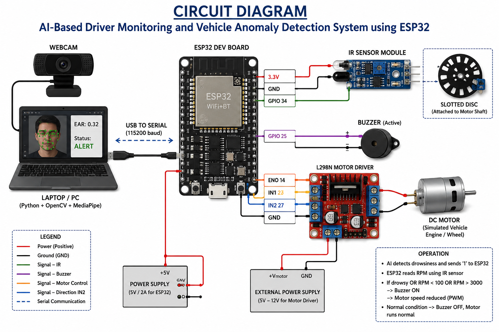
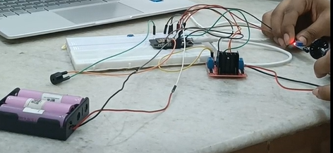
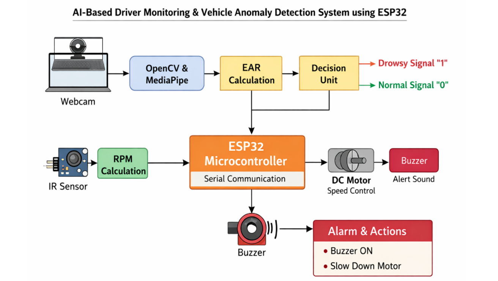

<p align="center">
  
</p>


#  AI-Based Driver Monitoring and Vehicle Anomaly Detection System using ESP32

Embedded Systems | Computer Vision | Real-Time Vehicle Safety System

---

#  Overview

This project presents a real-time AI-powered driver safety and vehicle anomaly monitoring system using ESP32, OpenCV, and MediaPipe.

The system continuously monitors:
- Driver drowsiness using Eye Aspect Ratio (EAR)
- Vehicle RPM anomalies using IR sensor feedback

When abnormal conditions are detected:
- A buzzer alert is activated
- Motor speed is automatically reduced using PWM control

The project combines Artificial Intelligence, Embedded Systems, and Real-Time Monitoring into a low-cost intelligent vehicle safety prototype.

---

#  Features

Real-time drowsiness detection  
RPM anomaly monitoring  
ESP32 embedded control system  
OpenCV + MediaPipe facial landmark detection  
PWM motor speed control  
Serial communication between Python and ESP32  
Automatic safety response system  
Low-cost embedded AI implementation  

---

#  Project Images

## Hardware Setup

<p align="center">
  
</p>

---

## Circuit Diagram

<p align="center">
  
</p>

---

## System Block Diagram

<p align="center">
  
</p>

---

#  System Architecture

```text
Webcam
   ↓
OpenCV Frame Capture
   ↓
MediaPipe Face Landmark Detection
   ↓
EAR Calculation
   ↓
Drowsiness Decision
   ↓
Serial Communication
   ↓
ESP32
   ↓
RPM Monitoring using IR Sensor
   ↓
Motor PWM + Buzzer Alert
```

---

#  Hardware Components

| Component | Quantity |
|---|---|
| ESP32 Dev Board | 1 |
| Webcam | 1 |
| IR Sensor Module | 1 |
| L298N Motor Driver | 1 |
| DC Motor | 1 |
| Active Buzzer | 1 |
| Breadboard | 1 |
| Jumper Wires | Multiple |

---

#  Software Technologies

## Programming
- Python
- Embedded C++

## Libraries
- OpenCV
- MediaPipe
- NumPy
- PySerial

## Tools
- Arduino IDE
- VS Code

---

#  Repository Structure

```text
AI-Based-Driver-Monitoring-and-Vehicle-Anomaly-Detection-System/
│
├── Hardware/
│   ├── README.md
│   └── circuit.png
│
├── doc/
│   ├── MPMC_Report.docx
│   ├── README.md
│   └── block.png
│
├── result/
│   ├── README.md
│   ├── demo.mp4
│   └── setup.png
│
├── software/
│   ├── README.md
│   ├── drowsiness_detection.py
│   └── esp32_driver_monitoring.ino
│
└── README.md
```

---

#  Driver Drowsiness Detection

The system uses MediaPipe facial landmark detection to monitor eye movements in real time.

Eye Aspect Ratio (EAR) is calculated continuously.

If EAR remains below threshold for consecutive frames:
- Driver marked as drowsy
- Alert signal sent to ESP32

---

#  RPM Monitoring

An IR sensor monitors motor RPM using pulse interrupts.

ESP32:
- Counts pulses
- Calculates RPM
- Detects abnormal RPM conditions

### RPM Thresholds
- RPM < 100 → Anomaly
- RPM > 3000 → Anomaly

---

#  Safety Response

If:
- Driver drowsiness is detected
OR
- RPM anomaly occurs

Then:
- Buzzer turns ON
- Motor speed reduces automatically

---

#  Results

| Test Scenario | Result |
|---|---|
| Eyes Open | Stable operation |
| Eyes Closed | Drowsiness detected |
| Normal RPM | No anomaly |
| RPM Abnormal | Alert activated |
| Combined Conditions | Full safety response |


---

#  Project Demonstration

 Demo Video available in:

```text
/result/demo.mp4
```

---

#  Documentation

Complete project documentation available in:

```text
/doc/MPMC_Report.docx
```

Documentation includes:
- Literature Review
- Working Principle
- Algorithms
- Hardware Design
- Software Design
- Results and Analysis
- Future Scope

---

##  Installation

### Clone Repository

```bash
git clone https://github.com/Kesihambigai22/AI-Based-Driver-Monitoring-and-Vehicle-Anomaly-Detection-System.git
```

### Install Dependencies

```bash
pip install opencv-python mediapipe numpy pyserial
```

### Run Python Code

```bash
python drowsiness_detection.py
```

### Upload ESP32 Code
Upload `esp32_driver_monitoring.ino` using Arduino IDE.

#  Future Scope

- OBD-II integration
- CAN Bus communication
- Steering analysis
- Cloud dashboard
- Fleet monitoring
- Raspberry Pi + Edge AI acceleration
- Real vehicle implementation

---

#  SDG Goals Covered

## SDG 3 – Good Health and Well-being
Improves road safety through early fatigue detection.

## SDG 9 – Industry, Innovation and Infrastructure
Demonstrates low-cost intelligent transportation systems.

## SDG 11 – Sustainable Cities and Communities
Supports safer and smarter transportation infrastructure.

---

#  Team Members

- Kesihambigai S

---


#  License

This project is developed for academic and research purposes.

---

#  Domains

`Embedded Systems` `ESP32` `Computer Vision` `OpenCV`
`MediaPipe` `Driver Monitoring` `Drowsiness Detection`
`IoT` `Vehicle Safety` `Edge AI`
